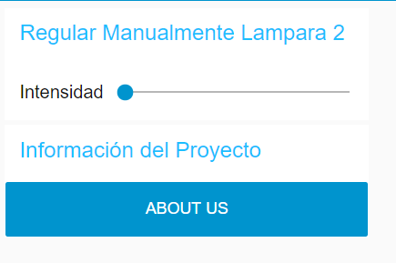

<h1>Proyecto Farola Inteligente</h1>

Autores: Evelin Flores, Tarik Imlahi Rivas y Mohammed el Boutahiri
<h2>I)	Descripción del Proyecto Básico</h2>
Para la parte de IoT(Internet of Things) se pretende fabricar una “Farola Inteligente” que pueda ser monitorizada y regulada a través de Internet. 
Dicha farola dispondrá como característica básica el incrementar la intensidad de luz en función del nivel de oscuridad presente en el ambiente, es decir, 
cuanta menos luz haya en la calle, más luz desprenderá el foco de la farola. 
Los datos de intensidad se reflejarán de forma automática a través de un cuadro de mandos en forma de gráficas. A su vez, estos datos quedarán reflejados en un histórico.

<h2>II)	Descripción del Proyecto Avanzado</h2>

Nuestra Farola podrá hacer lo siguiente:
-	Medir la luz ambiental
-	Regular la intensidad del foco en función de la luz ambiental
-	Enviar dichos datos a internet
Por otro lado, nuestra aplicación de monitorización podrá:
-	Mostrar Gráficas de Niveles de Luminosidad e histórico.
-	Mostrar Voltajes de Sensores.
-	Enviar emails a los Técnicos de Mantenimiento en respuesta de eventos inesperados del sistema (sensores rotos, luminosidad extrema)
-	Avisar de dichos eventos por medio de mensajes de voz automatizados
-	Regular la luminosidad manualmente de una Segunda Farola para comprobar que la comunicación llegaría a ser bidireccional

<h2>III)	Descripción del Proyecto Avanzado</h2>
Por un lado, se necesitan los siguientes materiales para el desarrollo:
-	2 x NodeMCUv3 (Uno para una farola regulada automáticamente y otro para una regulada manualmente).
-	2 x LED.
-	1 x KOhmn.
-	2 x Cables MiniUsb-USB.
-	1 x Sensor de Luminosidad.
-	1 x ProtoBoard y varios cables macho para conectar pines.

Y por otro, utilizaremos los siguientes Software:

-	Fritzing para el diseño y presentación de nuestro circuito
-	ARDUINO Versión: v1.8.2 para programar nuestros NodeMCU
-	Node-RED Versión: v0.16.2 para diseñar e implementar nuestro Dashboard de 
-	HiveMqTT para la comunicación de nuestros dispositivos físicos y nuestra aplicación de monitorización

<h2>IV)	Diseño del Circuito en Fritzing</h2>
Los esquemas en Fritzing serían los siguientes:

En este primer circuito solo vamos a necesitar un LED que controlaremos 
manualmente desde nuestra aplicación a través de internet.

En este segundo circuito añadiremos un sensor de luminosidad junto 
con una resistencia para que se regule la intensidad de la luz del LED automáticamente. Los valores de ese sensor conjunto algunos 
datos más serán monitorizados a través de nuestra aplicación remota.

<h2>VI)	Servicio Mqtt</h2>

En este punto lo que haremos será explicar a grandes rasgos cual va 
a ser el servidor que nos va a brindar el intercambio de mensaje Mqtt 
para que nuestros dispositivos y programas puedan transmitirse información 
entre sí.
En este proyecto hemos usado el servidor público que se nos oferta en la página,

<h2>VI)	Programación en Arduino</h2>
Vamos a mostrar ejemplos de los métodos y trozos de código más relevantes 
que han sido usados para programar los dos circuitos de las dos farolas 
respectivamente.
Para más detalle, en este misma entrega del proyecto se adjuntan los códigos de Arduino utilizados.
<h3>Inclusión de Librerías y Declaración de variables Globales</h3>

<h3>Conexión Wifi</h3>

<h3>Reconexión al Servicio Mqtt</h3>

<h3>Método para la subscripción al servicio Mqtt</h3>

<h2>VII)Instalación de Node-RED</h2>

La instalación de node-RED es muy sencilla y puede instalarse tanto para Windows como para Linux. Toda la información de los pormenores de la instalación vienen descritos en este enlace: https://nodered.org/docs/getting-started/installation
Para nuestro proyecto hemos instalado esta herramienta en un equipo Windows de la siguiente manera:
a)	Abrimos la consola de comandos y escribimos ejecutamos lo siguiente:
 	   npm install -g –unsafe-perm node-red
En algún punto de la instalación puede que se requiera o no la instalación de algún complemento, pero no hay ningún problema, la misma aplicación especificará el comando a utilizar.
b)	Y para agregarle el complemento de DashBoard debemos ejecutar en el directorio raíz de la aplicación lo siguiente:
        npm install node-red-dashboard
		
		

<h2>VIII)	Recepción, Emisión, Representación y Monitorización de los Datos.</h2>

Vamos a centrarnos en una sola parte de nuestro diagrama para ver de manera general cómo se trabaja en esta plataforma a nivel de recepción, envío y representación de la información.

Vamos a centrarnos en una sola parte de nuestro diagrama para ver de manera general cómo se trabaja en esta plataforma a nivel de recepción, envío y representación de la información.

El otro nodo con la misma etiqueta “Voltaje del Sensor” es de tipo gráfico. Lo que hace es mostrar a través de un contador con aguja la cantidad que le llega.

Los nodos tipo función tienen la característica de poder asignarle condiciones al parámetro de entrada que le entra y transmitir otro mensaje en la salida o decidir si el mensaje continúa su camino. Se programan en función de lo que nosotros estipulemos. En este caso hemos decidido que si el voltaje es inferior a 1 unidad, significa que el sensor esta inoperativo o inexistente y en consecuencia transmitirá un mensaje a los siguientes nodos.

Y por último si logra salir el mensaje de emergencia a los siguientes nodos, tendremos por un lado un envío de un mail al técnico de mantenimiento y una alerta de voz en nuestra plataforma que nos redactará el mensaje automáticamente en el idioma que elijamos. Cabe destacar que tendremos que usar una cuenta de correo electrónico de apoyo y autorizar la conexión remota indirecta de nuestro servicio.

Finalmente podemos observar que si en un momento dado quitamos algún cable de los que están conectados a nuestro sensor, nos llegará un correo advirtiéndonos de esa incidencia.

Siguiendo prácticamente los mismos pasos hemos hecho pruebas con diferentes gráficas.

Para el envio de información desde nuestra plataforma a nuestro circuito hemos seguido los mismos pasos pero en vez de usar un node de tipo recepción hemos usado uno de tipo emisión. Hemos usado un nodo tipo Slider y un nodo de emisión para enviar los datos.

<h2>IX)	Problemas Encontrados en el Desarrollo del Proyecto</h2>

Realmente todo ha ido sobre ruedas exceptuando algunos puntos en los que nos hemos atrancado más bien debido al desconocimiento en profundidad a nivel físico del dispositivo que a la hora de programar dicho dispositivo. Por ejemplo:
-	Un error cometido al principio fue conectar nuestro led al pin D0. Lo que no sabíamos era que dicho pin se comparte con la tarjeta de red para la comunicación, por lo que, a la hora de transmitir los datos pertinentes, se enviaban menos de diez mensajes al servidor y después el sistema se bloqueaba. La solución fue simplemente cambiar a otro pin y se acabó el problema
-	Intentar medir la diferencia de potencial entre las conexiones del LED. No nos dimos cuenta de que eran pines de salida y no de entrada. La solución era desviar con una resistencia dichas conexiones a unos puertos de entrada y a partir de ahí se podría calcular el voltaje de esos dos puntos. No se ha implementado al carecer de la resistencia precisa para dicha acción.
-	Problemas para conectar a desde la red de la universidad ya que hay puertos que no están operativos. Debemos conectarnos o a la wifi de nuestra casa o compartiendo wifi desde el móvil.
Si ha habido algún problema más no ha tenido la suficiente relevancia como para plasmarlo en esta memoria.

<h2>X)	Conclusiones Finales</h2>

Este pequeño proyecto nos ha dado pie a plantearnos poder crear muchas más aplicaciones en el campo de IoT, mucho más complejas y de manera realmente sencilla y dinámica. La asignatura brinda un abanico de posibilidades inmensa. No solo nos hemos percatado de esto en el desarrollo de nuestro proyecto, si no que hemos visto el avance en paralelo de los proyectos de los demás grupos de compañeros, que nos han parecido también muy interesantes.

